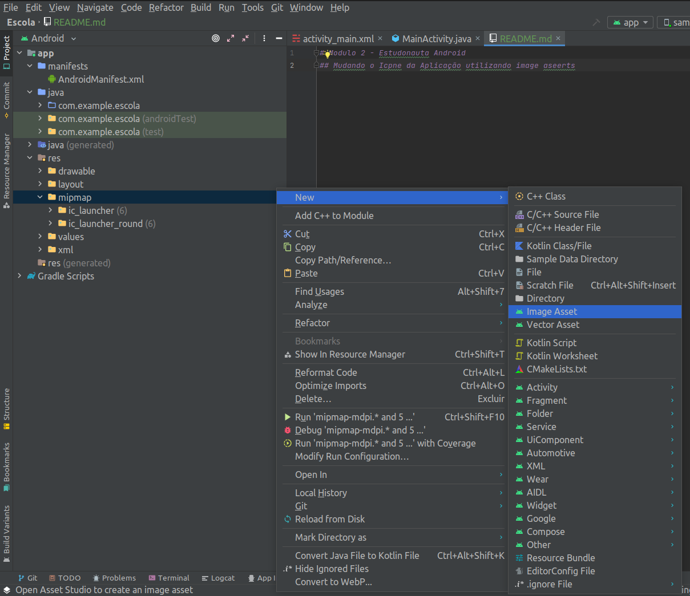

# Modulo 2 - Estudonauta Android

## Mudando o Icpne da Aplicação utilizando image aseerts




## Imagens Estaticas
Para colocar imagens na nossa app elas devem ser postas na pasta drawable 
### Ocultar a barra de status no Android 
Para oclutar a barra de titulo do app devemos colocar o codigo a seguir no arquiv AndoridManifest.xml
```xml
    <application
        ...
        android:theme="@android:style/Theme.Holo.NoActionBar.Fullscreen" >
        ...
    </application>
```