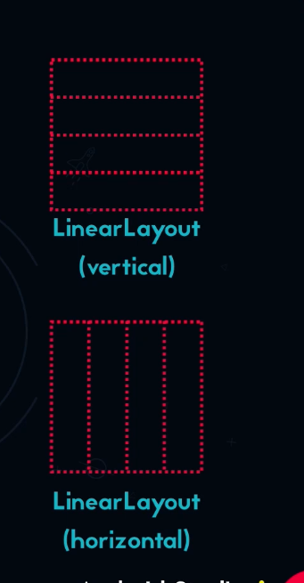
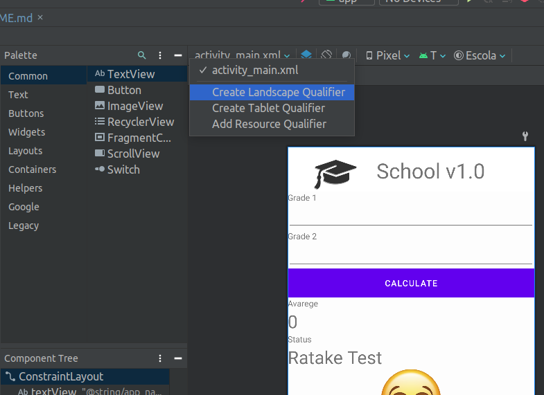

# Modulo 2 - Estudonauta Android

## Mudando o Icpne da Aplicação utilizando image aseerts


## Imagens Estaticas
Para colocar imagens na nossa app elas devem ser postas na pasta drawable 
### Ocultar a barra de status no Android 
Para oclutar a barra de titulo do app devemos colocar o codigo a seguir no arquivo themes.xml que se encorntra em `res/values/themes.xml`
```xml
...
<style name="Theme.NomeAplicação" parent="Theme.MaterialComponents.DayNight.NoActionBar">
...
```

## Linear Layouts


### Tipos de Linear Layauts



## Mensagens com Toast
Pequenas mensagens que aparecem na tela funcionam por alguns segundos e desaparecem suavemente

## Orientação Landscape Variation

Conifiguração de variação de tela


### Portraint Mode
#### Forçando o portraint mode
No arquivo AndroidManifest.xml em activity adicionamos o codigo abaixo
```xml
...
<activity
            android:name=".MainActivity"
                    android:exported="true"
                    android:configChanges="orientation"
                    android:screenOrientation="portrait">        
...
```

---
# Habilidades
- Alterar icone da app
- Usar imagens estaticas na view
- ligar componetes da view com codigo java
- Linear Layauts
- Multiplos idiomas
- Validação com mensagens de erro
- Mensagens toast
- usar cores em codigo java
  - Constantes
  - Hexadecimal
  - Cores declaradas no XML
- Mudar imagem apartir do codigo java
- tornando componentes ocultos
- ocultar o teclado
- Landscape Variantion(variação de layoute de tela)
- Manter a tela fixa sem Landscape Variantion